<div align="center">

# 🚀 Inventory Management System (IMS)

### _Next-Gen Resource Tracking & Management Solution_

[](https://nodejs.org/)
[](https://www.mysql.com/)
[](https://expressjs.com/)
[](https://hub.docker.com/)
[](https://cloud.google.com/)

[**Explore Docs**](#-documentation) · [**Report Bug**](https://github.com/Interns-MQI-25/project-interns/issues) · [**Request Feature**](https://github.com/Interns-MQI-25/project-interns/issues)

</div>

---

## 📖 Overview

The **Marquardt Inventory Management System (IMS)** is a robust, enterprise-grade application designed to streamline asset tracking, product requests, and approval workflows. Built with a modern tech stack, it features role-based access control, real-time inventory updates, and an **AI-powered assistant** to help users navigate complex data instantly.

### 🌟 Why This IMS?

- **Intelligent:** Integrated AI chatbot for real-time natural language queries.
- **Secure:** Role-based access (Employee, Monitor, Admin) with granular permissions.
- **Scalable:** Dockerized and cloud-ready (Google App Engine, Render).
- **User-Centric:** Modern, responsive UI with intuitive workflows.

---

## ✨ Key Features

| 🧑‍💼 **For Employees**                                     | 🔍 **For Monitors**                               | 👑 **For Admins**                                |
| :------------------------------------------------------- | :------------------------------------------------ | :----------------------------------------------- |
| **Request Products:** Easy submission for project needs. | **Approval Workflow:** Review & approve requests. | **User Management:** Full control over accounts. |
| **Stock View:** Browse live inventory with photos.       | **Stock Control:** Add/Edit products & files.     | **System Analytics:** Detailed usage reports.    |
| **History:** Track personal requests & returns.          | **Assign Assets:** Manage check-in/check-out.     | **Audit Logs:** Track all system activities.     |
| **AI Help:** Ask "Where is the soldering iron?".         | **Reports:** Generate assignment summaries.       | **Config:** Manage depts & settings.             |

### 🤖 Advanced AI Assistant

This system features a context-aware chatbot that provides:

- **Real-time Stock Checks:** "Is the Oscilloscope available?"
- **Assignment Tracking:** "Who has the Multimeter?"
- **Smart Summaries:** "Summarize my pending requests."

---

## 🛠️ Tech Stack

<div align="center">

|                                                    **Core**                                                    |                                                       **Backend**                                                       |                                                 **Data & Storage**                                                 |                                                     **DevOps**                                                      |
| :------------------------------------------------------------------------------------------------------------: | :---------------------------------------------------------------------------------------------------------------------: | :----------------------------------------------------------------------------------------------------------------: | :-----------------------------------------------------------------------------------------------------------------: |
|               |                  |                   |                 |
|  |                  |  |                 |
|              |  |                                                                                                                    |  |

</div>

---

## 🚀 Quick Start

### 🐳 Docker (Recommended)

Get up and running in seconds with Docker.

```bash
# 1. Pull the image
docker pull priyanshuksharma/project-interns:latest

# 2. Run the container
docker run -p 3000:3000 priyanshuksharma/project-interns:latest
```

Acces the app at `http://localhost:3000`

### 🔧 Manual Setup

For developers who want to contribute.

1.  **Clone & Install**

    ```bash
    git clone https://github.com/Interns-MQI-25/project-interns.git
    cd project-interns
    npm install
    ```

2.  **Database Config**

    - Create a MySQL database `product_management_system`.
    - Import schema: `mysql -u root -p product_management_system < sql/database.sql`
    - Rename `.env.example` to `.env` and update credentials.

3.  **Run**
    ```bash
    npm run dev  # Starts server with nodemon
    ```

---

## 📚 Documentation

We have organized comprehensive guides for deployment and troubleshooting in the `render_fixes/` directory:

- **☁️ [Cloud Deployment Guide](render_fixes/CLOUD_DEPLOYMENT_GUIDE.md):** Step-by-step instructions for GCP, Heroku, and AWS.
- **🛠️ Database Fixes:** Scripts like `fix_products_schema.js` are available in `render_fixes/` for troubleshooting schema mismatches.
- **📦 [Docker Complete Guide](DOCKER_COMPLETE_GUIDE.md):** Advanced Docker configurations.

---

## 🔐 Default Credentials

| Role         | Username     | Password      | Notes                   |
| :----------- | :----------- | :------------ | :---------------------- |
| **Admin**    | `admin`      | `admin123`    | _Change immediately!_   |
| **Monitor**  | `john.doe`   | `password123` | Sample monitor account  |
| **Employee** | `jane.smith` | `password123` | Sample employee account |

---

<h2 style="color:#2c5282; border-bottom:2px solid #2c5282; padding-bottom:8px; display:inline-block;">
  🏗️ System Architecture

```mermaid
graph TD
    subgraph Client ["🖥️ Client Layer"]
        Browser[("Browser (EJS/Tailwind)")]
    end

    subgraph Server ["⚙️ Application Layer"]
        LB[("Load Balancer (Nginx/Cloud)")]
        Node[("Node.js + Express API")]
        Auth[("Auth Middleware")]
        Logic[("Business Logic Controllers")]
    end

    subgraph Data ["💾 Data Layer"]
        DB[("MySQL / TiDB Cloud")]
        FS[("File Storage (Uploads)")]
    end

    subgraph External ["🌐 External Services"]
        SMTP[("Gmail SMTP")]
    end

    Browser <-->|HTTPS/Review| LB
    LB <--> Node
    Node --> Auth
    Auth --> Logic
    Logic <-->|SQL Queries| DB
    Logic <-->|Read/Write| FS
    Logic -->|Send Mail| SMTP

    style Client fill:#e6fffa,stroke:#38b2ac,stroke-width:2px
    style Server fill:#ebf8ff,stroke:#4299e1,stroke-width:2px
    style Data fill:#fff5f5,stroke:#fc8181,stroke-width:2px
    style External fill:#faf5ff,stroke:#9f7aea,stroke-width:2px
```

</h2>

<div align="center">



</div>

### Data Flow

1.  **Client Request:** User interacts with the responsive EJS interface.
2.  **Processing:** Requests are routed through Express.js middleware for authentication and validation.
3.  **Data Persistence:** Core business data is stored in the relational MySQL database, while file attachments are managed in local/cloud storage.
4.  **Notifications:** Critical actions trigger async email notifications via standard SMTP.

---

## 📂 Project Structure

```
project-interns/
├── 📁 config/           # App configuration
├── 📁 public/           # Static assets (CSS, JS, Images)
├── 📁 render_fixes/     # Deployment scripts & guides (New!)
├── 📁 scripts/          # Utility scripts
├── 📁 sql/              # Database schema (database.sql)
├── 📁 src/
│   ├── 📁 middleware/   # Auth & Validation
│   ├── 📁 routes/       # Express Routes
│   └── 📁 utils/        # Helpers (Email, Logger)
├── 📁 views/            # EJS Templates
│   ├── 📁 admin/        # Admin Dashboard
│   ├── 📁 employee/     # Employee Dashboard
│   └── 📁 monitor/      # Monitor Dashboard
├── app.yaml             # GCP Config
└── server.js            # Entry Point
```

---

## 🤝 Contributing

Contributions are what make the open-source community such an amazing place to learn, inspire, and create. Any contributions you make are **greatly appreciated**.

1.  Fork the Project
2.  Create your Feature Branch (`git checkout -b feature/AmazingFeature`)
3.  Commit your Changes (`git commit -m 'Add some AmazingFeature'`)
4.  Push to the Branch (`git push origin feature/AmazingFeature`)
5.  Open a Pull Request

---

<div align="center">

Made with ❤️ by the **Interns MQI 25** Team

</div>
