<div align="center">

# 🛠️ Inventory Management System (IMS)

### Enterprise-Grade Resource Tracking & Request Management

[](https://nodejs.org/)
[](https://www.mysql.com/)
[](https://expressjs.com/)
[](https://hub.docker.com/)
[](https://cloud.google.com/)

[**Documentation**](#-documentation) • [**Report Issue**](https://github.com/Interns-MQI-25/project-interns/issues) • [**Request Feature**](https://github.com/Interns-MQI-25/project-interns/issues)

</div>

---

## 📋 Executive Summary

The **Marquardt Inventory Management System (IMS)** is a specialized enterprise solution engineered to digitalize and streamline the asset lifecycle within Marquardt India Pvt. Ltd. It replaces manual tracking with a centralized, automated platform for managing product requests, approvals, and inventory auditing.

**Core Capabilities:**

- **Role-Based Access Control (RBAC):** Strictly enforcement of Employee, Monitor, and Administrator privileges.
- **Real-Time Inventory Integration:** Live tracking of stock levels with attached documentation and visuals.
- **Automated Workflows:** Email-driven notification pipelines for requests, approvals, and registration events.
- **AI-Driven Assistance:** Integrated chatbot for natural language queries regarding stock availability and assignments.

---

## 💎 Key Features

### 🏢 For Administrative Control

| Feature                  | Description                                                                                                 |
| :----------------------- | :---------------------------------------------------------------------------------------------------------- |
| **🛡️ User Provisioning** | comprehensive lifecycle management for employee accounts, including registration approval and deactivation. |
| **📊 System Analytics**  | High-level dashboards visualizing request volume, stock turnover, and user activity metrics.                |
| **📜 Audit Trails**      | Immutable logs of all critical system actions for security and compliance auditing.                         |
| **⚙️ Dept Management**   | Dynamic configuration of organizational departments and role assignments.                                   |

### 🔎 For Inventory Oversight (Monitors)

| Feature                      | Description                                                                              |
| :--------------------------- | :--------------------------------------------------------------------------------------- |
| **📡 Approval Pipeline**     | Centralized queue for reviewing and processing product requests from employees.          |
| **📦 Asset Management**      | CRUD operations for inventory items, including specification uploads and bulk edits.     |
| **📋 Assignment Tracking**   | Real-time monitoring of checked-out assets, return dates, and overdue alerts.            |
| **📁 Documentation Control** | Management of technical manuals, calibration certificates, and asset visual attachments. |

### 💼 For Employee Productivity

| Feature                      | Description                                                                             |
| :--------------------------- | :-------------------------------------------------------------------------------------- |
| **🖊️ Streamlined Requests**  | Simplified interface for submitting project-related asset requisitions.                 |
| **👁️ Live Stock Visibility** | Searchable, filterable catalog of available equipment with real-time status indicators. |
| **🗂️ Personal Dashboard**    | Unified view of active assignments, request history, and pending approvals.             |
| **🤖 AI Support**            | "Where is the Oscilloscope?" - Instant answers via the integrated AI assistant.         |

---

## 🔧 Technical Architecture

This system resembles a modern N-tier architecture optimized for scalability and modularity.

```mermaid
graph TD
    subgraph Client ["💻 Client Presentation Layer"]
        Browser[("Browser (EJS / Tailwind CSS)")]
    end

    subgraph Server ["⚙️ Application Business Layer"]
        LB[("Load Balancer (Nginx / GCP)")]
        Node[("Node.js Runtime")]
        Express[("Express.js Framework")]
        Auth[("Auth Middleware (Bcrypt/Session)")]
        Logic[("Controllers & Services")]
    end

    subgraph Data ["💾 Data Persistence Layer"]
        DB[("MySQL 8.0 / TiDB Cloud")]
        FS[("File System / Cloud Storage")]
    end

    subgraph Ext ["🌐 External Integrations"]
        SMTP[("SMTP Relay (Gmail)")]
    end

    Browser <-->|HTTPS / TLS| LB
    LB <--> Node
    Node --> Express
    Express --> Auth
    Auth --> Logic
    Logic <-->|SQL / TCP| DB
    Logic <-->|I/O| FS
    Logic -->|SMTP / TLS| SMTP

    style Client fill:transparent,stroke:#38b2ac,stroke-width:2px
    style Server fill:transparent,stroke:#2c5282,stroke-width:2px
    style Data fill:transparent,stroke:#e53e3e,stroke-width:2px
    style Ext fill:transparent,stroke:#805ad5,stroke-width:2px
```

<h3 style="color:#2c5282;">🏗️ System Architecture Diagram</h3>

<div align="center">



</div>

**Data Flow Sequence:**

1.  **Request Initiation:** User submits a secure HTTPS request via the reactive EJS/Tailwind frontend.
2.  **Authentication & Routing:** The Express.js router validates the session via `express-session` and routes traffic to the appropriate controller.
3.  **Business Logic Processing:** Controllers execute business rules (e.g., checking stock availability, validating permissions).
4.  **Data Persistence:** Transactions are committed to the MySQL database. File uploads are sanitized and stored.
5.  **External Communication:** Asynchronous notifications are dispatched via Nodemailer to relevant stakeholders.

---

## 💻 Tech Stack & Dependencies

<details>
<summary><strong>Click to expand full dependency list</strong></summary>

| Category          | Technology       | Version   | Purpose                                       |
| :---------------- | :--------------- | :-------- | :-------------------------------------------- |
| **Runtime**       | **Node.js**      | `^20.0.0` | JavaScript execution environment              |
| **Framework**     | **Express**      | `^4.19.2` | Web server framework                          |
| **Database**      | **MySQL**        | `^8.0.0`  | Relational database management                |
| **ORM/Driver**    | **MySQL2**       | `^3.11.0` | Database driver with Promise support          |
| **Security**      | **Bcryptjs**     | `^2.4.3`  | Password hashing algorithm                    |
| **Templating**    | **EJS**          | `^3.1.10` | Server-side rendering template engine         |
| **Styling**       | **Tailwind CSS** | `^3.4.0`  | Utility-first CSS framework                   |
| **Email**         | **Nodemailer**   | `^7.0.9`  | Email sending service                         |
| **File Handling** | **Multer**       | `^1.4.5`  | Middleware for handling `multipart/form-data` |
| **Utilities**     | **XLSX**         | `^0.18.5` | Excel file parsing and generation             |

</details>

---

## 🚀 Deployment & Setup Guide

### 🐳 Docker Configuration (Recommended)

The system is fully containerized for consistency across environments.

```bash
# 1. Pull the official image
docker pull priyanshuksharma/project-interns:latest

# 2. Launch the container (Production Mode)
docker run -d \
  -p 3000:3000 \
  -e NODE_ENV=production \
  -e DB_HOST=your_host \
  --name ims-app \
  priyanshuksharma/project-interns:latest
```

### 🔧 Manual Development Setup

1.  **Clone Repository**
    ```bash
    git clone https://github.com/Interns-MQI-25/project-interns.git
    cd project-interns
    ```
2.  **Install Dependencies**
    ```bash
    npm ci
    ```
3.  **Configure Environment**
    - Duplicate `.env.example` to `.env`
    - Populate database credentials (`DB_HOST`, `DB_USER`, `DB_PASS`)
4.  **Initialize Database**
    ```bash
    npm run setup-db
    ```
5.  **Start Development Server**
    ```bash
    npm run dev
    ```

---

## 📚 Comprehensive Documentation

We maintain specific guides for different operational needs. Please refer to the `render_fixes/` directory for specialized deployment instructions.

- ☁️ **[Cloud Deployment Strategy](render_fixes/CLOUD_DEPLOYMENT_GUIDE.md)**
  - Detailed workflows for Google Cloud Platform (App Engine), Heroku, and AWS Elastic Beanstalk.
- 🛠️ **[Database Maintenance](render_fixes/fix_products_schema.js)**
  - Schema migration scripts and troubleshooting tools.
- 📦 **[Docker Deep Dive](docs/DOCKER_COMPLETE_GUIDE.md)**
  - Advanced container orchestration and networking.

---

## 📂 Project Structure

```bash
project-interns/
├── 📁 config/           # Application configuration & env parsers
├── 📁 data/             # Data files (CSV, Excel, Templates)
├── 📁 dist/             # Executable builds (Windows .exe)
├── 📁 docs/             # Documentation & Deployment Guides
├── 📁 public/           # Static assets (Compiled CSS, Client JS)
├── 📁 render_fixes/     # Deployment patches & cloud guides
├── 📁 scripts/          # DevOps & Maintenance utilities (JS, BAT, SH)
├── 📁 sql/              # SQL Schema definitions & migrations
├── 📁 src/
│   ├── 📁 middleware/   # Security & Session middleware
│   ├── 📁 routes/       # Express Route definitions
│   └── 📁 utils/        # Shared helper libraries
├── 📁 views/            # EJS Templates
├── app.yaml             # Google App Engine specification
└── server.js            # Application entry point
```

---

## 👥 Contribution Guidelines

We welcome contributions from the development community.

1.  **Fork** the repository.
2.  Create a **Feature Branch** (`git checkout -b feature/AdvancedAnalytics`).
3.  **Commit** your changes with semantic messages.
4.  **Push** to the branch.
5.  Open a **Pull Request** for code review.

---

<div align="center">

**Developed by Interns MQI 25**
_Empowering Efficiency through Technology_

</div>
